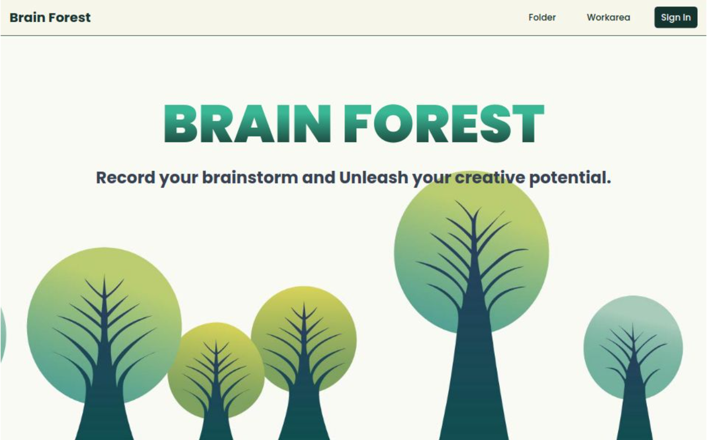

# Brain Forest

### An online mind mapping tool that visualizes your brainstorming.

  

- **Test account**：demo@gmail.com
- **Test password**：000000

Brain Forest is an online mind mapping tool that visualizes your ideas, combining both left-brain and right-brain thinking to spark unlimited creative possibilities. It offers a wealth of styling tools and customization features, along with a built-in AI assistant to help you boost efficiency and unleash more creative potential.

## Features

- **Visualized Tree Structure** : real-time dynamic adjustment of mind map nodes.
- **Multiple Operation Modes** : choose between button and shortcut key systems based on user preferences.
- **Node Management** : add/edit/delete nodes, child nodes, summary nodes, and relation nodes.
- **Toolbox** : a variety of editing tools for shapes, text, background, and layout.
- **Markdown Support** : export/import Markdown files.
- **Custom Bezier Curves** : customize the shape of the connecting lines for relation nodes.
- **AI Assistant** : AI tools for quickly generating mind maps.

## Technologies

- Next.js
  - App Router
  - API Routes
- React
  - React Hooks
  - React Context
- Firebase
  - Firestore Database
  - Authentication
- Markdown
  - remark-frontmatter
  - remark-parse
  - yaml
- SVG
- Tailwind CSS
- Vercel
- Axios
- OpenAI
- Sweetalert2
- React-color
- React-icons
- React-spinners

## Demo

### Button System

Select nodes and click the button to perform corresponding actions such as adding or deleting nodes.

  

### Shortcut Key System

Select nodes and type the shortcut key to perform corresponding actions such as adding or deleting nodes.

  

### Toolbox

Includes tools for shape editing, text editing, background styles, and layout styles, allowing you to freely adjust the appearance of nodes to achieve a highly customized mind map design.

  
  

### Markdown Support

Supports export and import functionality in Markdown format. Users can export mind map content to Markdown or import Markdown files to generate new mind map components, ensuring seamless integration with other tools.

  

### SVG

Uses SVG to draw connecting lines and simulates Bezier curve handles for intuitive and flexible adjustments of line shapes.

  

### AI Tool

Utilizes the OpenAI API to automatically generate relevant mind map components based on the input topic, speeding up efficiency while sparking more creativity.

  

## Contact Me

- Guan Jhen Hong
- selena606352000@gmail.com
